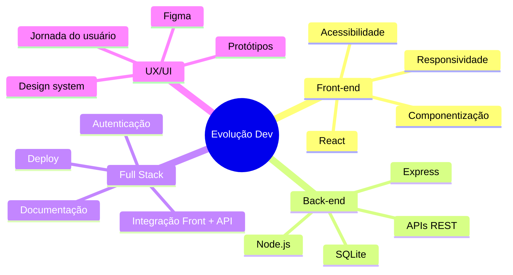

<div align="center">

# 👋 Olá, eu sou Paulo Henrique Moreira

[](https://git.io/typing-svg)

</div>

---

## 🚀 Sobre mim

Sou **Analista Desenvolvedor Júnior**, com atuação em **OutSystems Legacy**, manutenção de sistemas, análise de requisitos, correção de bugs, testes e melhoria contínua de aplicações.

Também estou em evolução como **Desenvolvedor Full Stack**, estudando e desenvolvendo projetos com **HTML, CSS, Sass, JavaScript, React, Node.js, Express, SQLite, APIs REST e UI/UX**.

Tenho formação em **Blockchain e Criptografia Digital**, formação **Full Stack pela Empower / Vai na Web - Kodie Academy**, curso **Análise e Desenvolvimento de Sistemas** na FASUL Educacional e pós-graduação em andamento na área de **User Experience (UX) e User Interface (UI)**.

> Gosto de transformar ideias em soluções digitais funcionais, organizadas e com boa experiência para o usuário.

---

## 🎯 Posicionamento profissional

```txt
Desenvolvedor em evolução com base em Front-end, Back-end, Full Stack e UX/UI.
Foco em construir aplicações úteis, responsivas, bem organizadas e com código limpo.
```

- 💻 Desenvolvimento Front-end com foco em interfaces responsivas
- ⚙️ Back-end com Node.js, Express, APIs REST e SQLite
- 🎨 UX/UI com Figma, Photoshop e Illustrator
- 🧪 Testes, correção de bugs e melhoria de sistemas legados
- 📚 Aprendizado contínuo em desenvolvimento de software
- 🚀 Interesse em projetos reais, impacto social e soluções escaláveis

---

## 🧰 Tecnologias e ferramentas

### 🎨 Front-end


### ⚙️ Back-end


### 🗄️ Banco de dados


### 🎨 UX/UI e Design


### 🚀 Deploy, versionamento e ferramentas


---

## 📌 Projetos em destaque

<div align="center">

<a href="https://github.com/paulohenriquemoreira/projeto_fullstack_do_sistema_de_gestao_de_abrigos">
  
</a>

<a href="https://github.com/paulohenriquemoreira/projeto_api_sistema_de_gestao_de_abrigos">
  
</a>

<a href="https://github.com/paulohenriquemoreira/ONG_Apoio_Pleno_API">
  
</a>

<a href="https://github.com/paulohenriquemoreira/ZelaCidade">
  
</a>

</div>

---

## 🧠 O que estou estudando e praticando



---

## 📊 Métricas do GitHub

<div align="center">


</div>

<div align="center">


</div>

<div align="center">


</div>

---

## 🏆 Conquistas

<div align="center">


</div>

---

## 💼 Ideias de projetos para fortalecer meu portfólio

### Front-end
- Landing page profissional com foco em conversão
- Dashboard responsivo com gráficos e filtros
- Clone de interface com atenção a UX/UI e acessibilidade
- Projeto com React, componentes reutilizáveis e consumo de API

### Back-end
- API REST com Node.js, Express e SQLite
- Autenticação com JWT
- Documentação com Swagger ou Postman
- Testes de rotas e tratamento profissional de erros

### Full Stack
- Sistema completo com cadastro, login, CRUD, dashboard e deploy
- Aplicação social/ONG com impacto real
- Sistema financeiro pessoal com relatórios e categorias
- Plataforma de agendamento com painel administrativo

---

## 📫 Contato

<div align="center">

[](https://www.linkedin.com/in/paulohenriquemoreira1986/)
[](mailto:paulo.henrick.moreira@hotmail.com)
[](https://github.com/paulohenriquemoreira)

</div>

---

<div align="center">

### ✨ Obrigado por visitar meu perfil!


</div>


